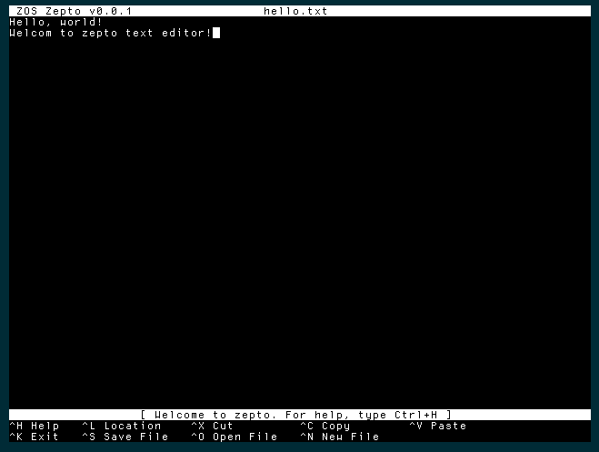

<h2 align="center">Zepto text editor</h2>
<p align="center">
    
</p>
<p align="center">
    <a href="https://opensource.org/licenses/Apache-2.0">
        
    </a>
    <p align="center">Presenting <b>Zepto</b>: A clone of nano entirely written in Z80 assembly, for Zeal 8-bit OS</p>
</p>


## About Zepto

The goal of Zepto is to provide a text editor for [Zeal 8-bit OS](https://github.com/Zeal8bit/Zeal-8-bit-OS) that is complete enough to write some code of text files, without taking too much disk space.
This is why I decided to make a clone of the famous `nano` text editor present on Linux. The problem is `nano` is written in C and is tied to the libC and Linux kernel. As such, I decided to write a clone from scratch, in Z80 assembly, to minimize the space and time it will take.

Thus, `nano` was only used as a source of **inspiration**, its code was not used **at all** in this project.

## Features and limitations

Zepto is still in alpha, here are the features implemented:

* Less than **4KB** once compiled!
* Use Zeal 8-bit OS cursor and keyboard API, so completely portable
* Use *Gap Buffer* data structure to avoid line length limitation
* Use Controller-Model-View architecture
* Open an existing file given as a parameter
* Edit the file content, can split lines, can add characters at the beginning, at the middle and at the end of lines
* Support upper, lower case and special characters
* Support scrolling up and down in the file
* Support `Ctrl + Key` for menu selection
* Support `Location` option
* Support `Save file` option
* Support `Exit` option
* Support "Save file on exit" question

Regarding the current limitations:

* Screen size is hardcoded to 80x40 characters. In the future, it should use Zeal 8-bit OS video API to get the screen area size
* Doesn't support memory paging, so the maximum file size is limited by the amount of RAM mapped at once: around 40KB
* No way to remove an empty line. Once a new line is created, it cannot be removed, it'll always be in the file
* It is not possible to modify the file destination once the file is opened. For example, if the file `B:/file.txt` is opened, it is not possible to save it under a new name
* Copy/Paste/Cut/Help/Open File/New File are not implemented

## Building the project

### Requirements

At the moment, the project has only been assembled on Linux (Ubuntu 20.04 and 22.04), it should be compatible with Mac OS and Windows as long as you have:

* bash
* git (to clone this repo)
* make
* Zeal 8-bit OS source code. Only the `kernel_headers` directory is required
* Zeal 8-bit OS v0.3.0 or above on the target computer. The older versions don't implement cursor and video APIs
* z88dk v2.2 (or later). Only its assembler, `z80asm`, is strictly required. The latest version of `z80asm` must be used as earlier versions don't have support for `MACRO`.

To install z88dk, please [check out their Github project](https://github.com/z88dk/z88dk).

### Building

To build the program, define the path to Zeal 8-bit OS, this will let us find the header files used to assemble zepto:
```
export ZOS_PATH=/your/path/to/Zeal8bitOS
```
Then simply use the command:
```
make
```

After compiling, the folder `bin/` should contain the binary `zepto.bin`. This file can be then loaded to Zeal 8-bit OS through UART thanks to the `load` command.

The binary can also be embedded within the `romdisk` that will contain both the OS and a read-only file system. For example:
```
cd $ZOS_PATH
export EXTRA_ROMDISK_FILES="/path/to/zepto/bin/zepto.bin"
make
```

More info about compiling Zeal 8-bit OS [here](https://github.com/Zeal8bit/Zeal-8-bit-OS#getting-started).

The resulted ROM image can then be provided to an emulator or directly flashed to the computer's ROM that will use it.

## Usage

If you are using Zeal 8-bit OS default romdisk, you can use `exec` command to execute `zepto.bin` or directly use `./`, followed by the source/destination file:
```
A:/>exec zepto.bin B:/your_file.txt
```
or
```
A:/>./zepto.bin B:/your_file.txt
```

As said above, keep in mind that once opened, the file cannot be renamed or saved somewhere else, so make sure you specify a destination disk that is **write-read**! (`A:/` disk isn't by default)


## Contact

For any suggestion or request, you can contact me at contact [at] zeal8bit [dot] com

Or, you can join Zeal 8-bit projects [Discord server](https://discord.gg/UzEjwRvBBb).

For features requests, you can also open an issue or a pull request.

## Contributing

Contributions are welcome! Feel free to fix any bug that you may see or encounter, or implement any feature that you find important.

To contribute:
  * Fork the Project
  * Create your feature Branch (*optional*)
  * Commit your changes. Please make a clear and concise commit message (*)
  * Push to the branch
  * Open a Pull Request


(*) A good commit message is as follow:
```
Module: add/fix/remove a from b

Explanation on what/how/why
```
For example:
```
Flash: add the possibility to flash programs bigger than 48KB
```

## License

Distributed under the Apache 2.0 License. See `LICENSE` file for more information.

You are free to use it for personal and commercial use, the boilerplate present in each file must not be removed.
